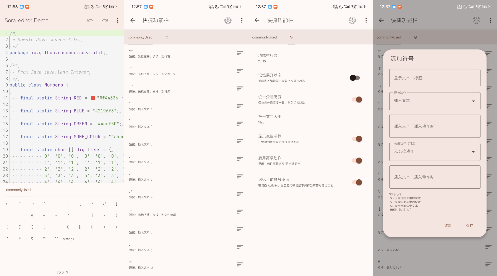

# zero-Symbol-input-view 模块文档

## 1. 模块简介

`zero-Symbol-input-view` 是一个面向代码编辑场景的 **符号输入增强模块**，围绕 `CodeEditor`（Sora Editor）提供：

- 多分组符号面板（分页管理）
- 可手势展开/收起的高级符号抽屉
- 可配置的分组指示器样式（标准 / 简洁圆点胶囊 / 隐藏 / 顶部线 / 块状）
- 符号管理页（增删改查、导入导出、排序、批量操作）
- 宏指令插入能力（`$$`、`$S`、`$E`、`$T`）

该模块适用于：

- 代码编辑器
- 文本编辑器
- Markdown/脚本输入场景
- 需要“快捷符号 + 快捷编辑动作”的输入型 App



---


## 2. 核心能力与特性

### 2.1 高级符号输入视图（AdvancedSymbolInputView）

- 支持绑定 `CodeEditor`
- 支持手势拖拽抽屉高度
- 支持记忆展开状态、记忆当前符号分页
- 支持统一分组高度，减少切页跳动
- 支持分组指示器风格切换
- 支持短按/长按两套动作

### 2.2 符号数据管理（SymbolDataManager）

- 使用 SharedPreferences 持久化分组数据与 UI 设置
- 首次无数据时自动注入默认分组（`SymbolDefaults`）并缓存
- 统一管理设置项读取与保存

### 2.3 符号管理能力（SymbolManagerActivity）

- 新增/删除/重命名分组
- 新增/编辑/复制/移动/删除符号项
- 批量操作（复制、剪切、反选、删除等）
- 支持从剪贴板和文件导入导出
- Material 风格设置与编辑对话框
- 支持来自MT管理器符号输入工具栏管理界面导出的符号配置json文件直接导入使用

### 2.4 宏指令插入（SymbolActionExecutor）

模块支持以下基础宏：

- `$$`：插入字面量 `$`
- `$S`：设置插入后选区起始位置
- `$E`：设置插入后选区结束位置
- `$T`：当前选中文本

示例：`{$S$T$E}`

含义：插入包裹结构并保留/恢复选中内容到目标位置，便于快速模板输入。

---

## 3. 模块优点

1. **编辑效率高**：将常用符号与编辑动作前置，减少软键盘切换成本。
2. **可配置性强**：分组、动作、显示文本、指示器样式均可自定义。
3. **状态记忆完整**：支持记忆展开状态与当前页面，增强连续编辑体验。
4. **扩展性好**：通过宏指令可构建模板化插入能力。
5. **工程接入轻量**：以 View + Activity 形式提供，落地简单。

---

## 4. 快速对接指南（在自己项目中使用）

> 以下示例假设你已有 Sora `CodeEditor`，并已将本模块纳入工程（同仓库 module 或独立依赖）。

### 4.1 Gradle 接入

在宿主项目 `settings.gradle(.kts)` 中包含模块（同仓库场景）：

```kotlin
include(":zero-Symbol-input-view")
```

在 app 模块依赖中添加：

```kotlin
dependencies {
    implementation(project(":zero-Symbol-input-view"))
}
```

### 4.2 布局中放置控件

```xml
<android.zero.studio.widget.editor.symbolinput.AdvancedSymbolInputView
    android:id="@+id/symbol_input_view"
    android:layout_width="match_parent"
    android:layout_height="wrap_content"/>
```

### 4.3 在页面中绑定 CodeEditor

```kotlin
val editor = findViewById<io.github.rosemoe.sora.widget.CodeEditor>(R.id.editor)
val symbolInputView = findViewById<android.zero.studio.widget.editor.symbolinput.AdvancedSymbolInputView>(R.id.symbol_input_view)

symbolInputView.bindEditor(editor)

// 可选：点击“管理”入口时跳转模块管理页
symbolInputView.onOpenManagerListener = {
    startActivity(Intent(this, android.zero.studio.widget.editor.symbolinput.SymbolManagerActivity::class.java))
}
```

### 4.4 生命周期建议

在宿主 `onResume()` 中恢复抽屉状态：

```kotlin
override fun onResume() {
    super.onResume()
    symbolInputView.onHostResume()
}
```

当你修改了分组或设置并希望主动刷新：

```kotlin
symbolInputView.refreshData()
```

---

## 5. 设置项说明（建议给用户暴露）

模块内置并持久化以下核心设置：

- 功能栏行数（折叠最小行数 / 每行符号数）
- 分组指示器样式
- 记忆展开状态
- 统一分组高度
- 符号文字大小
- 记忆当前符号分页
- 是否启用高级动作

这些设置由 `SymbolDataManager.getUiSettings()` / `saveUiSettings()` 管理。

---

## 6. 如何扩展你自己的符号体系

### 6.1 自定义默认分组

- 可修改 `SymbolDefaults.createFallbackGroups()` 的默认数据模板。
- 首次运行将自动写入缓存，后续从持久化配置读取。

### 6.2 自定义动作

- 符号项支持短按与长按动作值。
- 插入类动作可结合宏指令构建模板。

### 6.3 导入导出

- 可通过管理页直接完成剪贴板/文件导入导出。
- 适合团队共享符号配置（如语言模板、注释模板、脚手架片段）。

---

## 7. 典型使用场景

1. **代码模板插入**：如函数模板、条件语句模板。
2. **注释增强**：快速注入注释块、文档标签。
3. **语言特定符号组**：按语言（Java/Kotlin/JS/Python）分组。
4. **移动端高频编辑**：替代软键盘二级符号输入路径。

---

## 8. 最佳实践建议

1. 抽屉默认保持折叠，避免初次进入遮挡编辑区域。
2. 开启“记忆当前分页”，提升连续输入效率。
3. 为高频模板配置 `$S/$E/$T`，减少重复选区操作。
4. 分组数量较多时优先使用“简洁（圆点胶囊）”或“隐藏”提升视觉聚焦。
5. 对团队场景定期导出配置，保证设备间一致性。

---

## 9. 常见问题（FAQ）

### Q1：隐藏指示器后还能切换分页吗？
可以。隐藏仅影响指示器视觉，不影响 `ViewPager` 滑动与 Tab 切换行为。

### Q2：首次使用为什么会有默认分组？
模块在无历史数据时会自动注入并保存默认分组，保证可用性与稳定性。

### Q3：宏指令是否可组合？
可以。`$S/$E/$T/$$` 支持在同一插入文本中组合使用。

---

## 10. 版本维护建议

- 每次调整默认分组结构后，建议提供“迁移策略”或“重置入口”。
- 若扩展宏语法，建议同步更新符号编辑对话框中的帮助文案。
- 若引入新指示器样式，建议在设置页提供可视化预览文案说明。

---

## 11. 关于 `followSystemIme` 布尔属性说明

`AdvancedSymbolInputView` 目前仍保留 `followSystemIme: Boolean` 属性用于兼容旧接口。

- 当前状态：该字段可用。
- 行为说明：它当前属于兼容占位属性，本身不会直接驱动布局跟随 IME 的行为。

如果你的宿主工程依赖旧版本 API 形态，可以继续保留该字段赋值；若无此兼容需求，可忽略。

---

## 12. 模块结构参考

```text
zero-Symbol-input-view/
├── build.gradle.kts
└── src/main/
    ├── kotlin/android/zero/studio/widget/editor/symbolinput/
    │   ├── AdvancedSymbolInputView.kt
    │   ├── SymbolManagerActivity.kt
    │   ├── SymbolDataManager.kt
    │   ├── SymbolDefaults.kt
    │   └── SymbolActionExecutor.kt
    └── res/
        ├── layout/
        ├── values/
        └── drawable/
```
